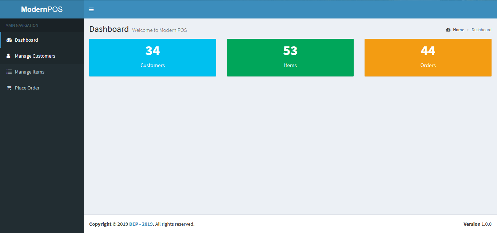
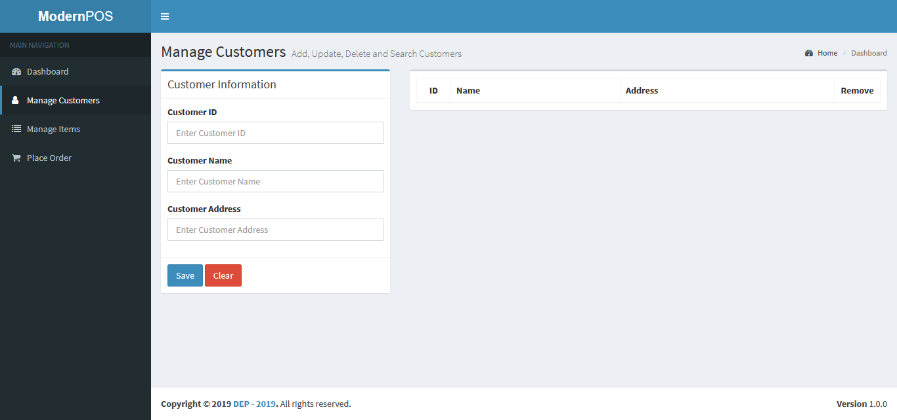
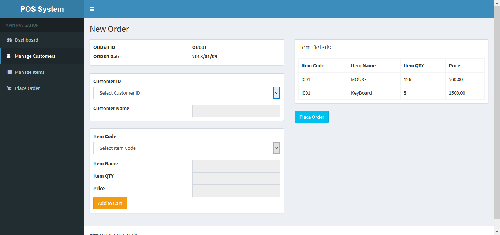

# **Point Of Sales System** <h1>

    
Point of Sales system is the time and place where a retail transaction is completed.At the POS, the merchant calculates the amount owed by the customer.Used Node JS.

	<ul>
		 <li>By selecting customer out of the main operations show in the image, merchant can add a customer for the database to take an order from that customer.All the data will be stored in the MYSQL database.Merchant wants to give customer's name and address with an ID to register a new customer.ID should be unique for each customer.</li>
                                        <li>By selecting item out of the main operations show in the image, merchant can add an item according to proceedure of customer registering.Merchant should give details about item description,quantity, and unit price with an Item code.Item code should be unique for an each item.</li>
                                        <li>By selecting order out of the main operations show in the image, merchant can place an order.Merchant should give customer Id and item code.According to the customer id, system will get the name of the customer.Based on the item code system will get the item description,quantity and unit price.Details of the each purchased item will added to the order after input the purchased quantity.Finally order will be placed with displaying total amount.</li>
                                        <li>By selecting view out of the main operations show in the image, merchant can view customer, item and order details.Also merchant can search all that details by their Ids.</li>
	</ul>

				

